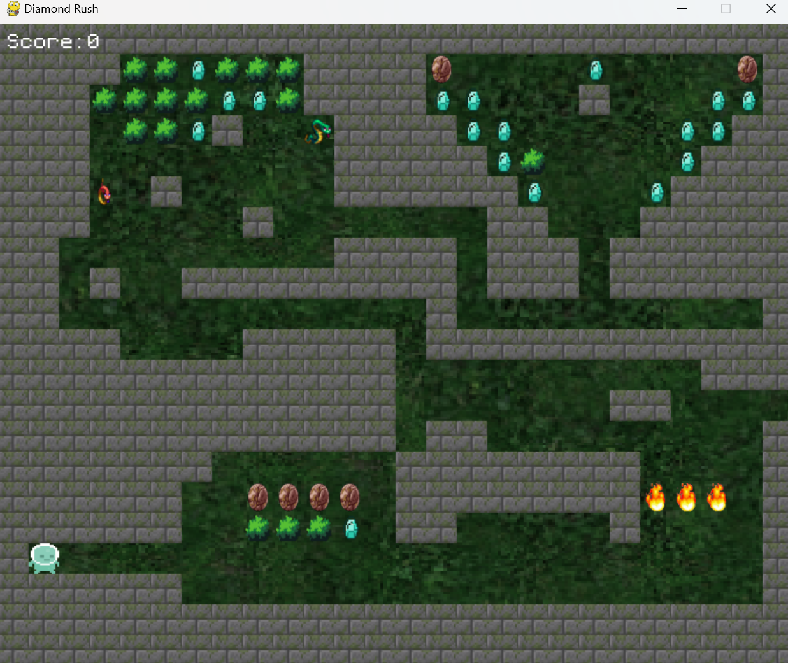
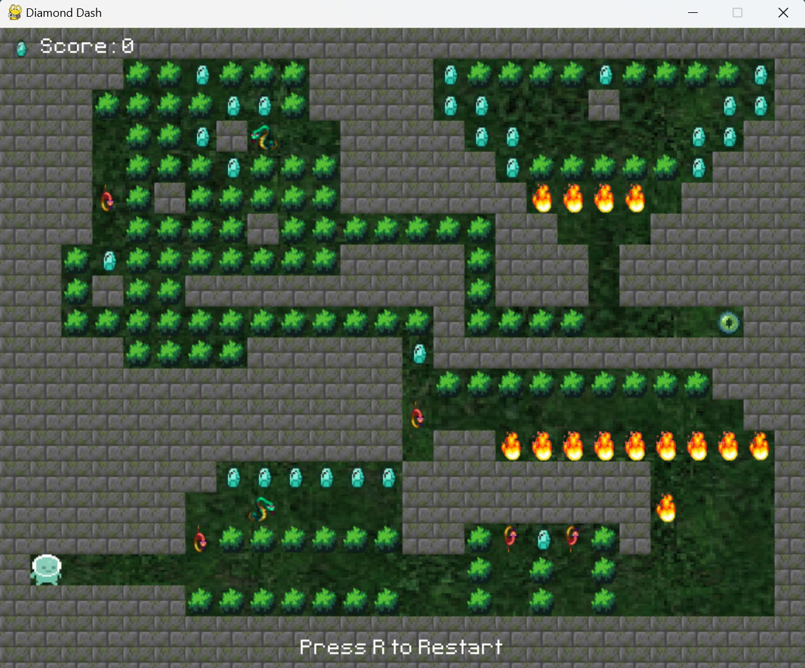

#Diamond Dash
CS110 Final Project Fall, 2024

##Team Members
- Kushal Padshala
- kpadshala@bignhamton.edu

##Project Description
Introducing Diamond Dash, in this game you control a character who must navigate through complex mazes, collecting diamonds while avoiding hazards like snakes and fires. With multiple levels that increase in difficulty, Diamond Dash provides a fun and challenging experience. Your mission? Collect as many diamonds as possible while making your way to the end of each maze.

##GUI Design
###Initial Design

###Final Design

##Program DesignAAAAA
###Features
- Maze Navigation: Control your character to navigate through various mazes, picking up diamonds along the way.
- Obstacle Avoidance: Avoid snakes and fires that move and spread.
- Multiple Levels: Variety of levels with increasing difficulty, each featuring unique maze layouts and challenges.
- Score Tracking: Keep track of your score based on the number of diamonds you collect.
- Interactive Start and End Screens: Receive clear instructions and feedback through start and end screens.

##Classes
- Bush: These are static obstacles that you can pass through without any issues.
- Diamond: Collect these to increase your score.
- Fire: Fire spreads over time and can harm you if you touch it.
- Maze: This class handles creating and drawing the maze, as well as updating dynamic elements like snakes and fires.
- Player: This class manages your movement and interactions within the game.
- Snake: Snakes move in specific directions and change course when they hit obstacles.
- Wall: These are static obstacles that you can't pass through.

##ATP (Acceptance Test Procedure)
| Step | Description |  Results |
|------|-----------|------------------|
| 1    | Run the Game | The start screen appears with the game logo and instructions to press SPACE to play. |
| 2    | Press SPACE on the Start Screen | The game begins, and your character appears at the starting position in the maze. |
| 3    | Use Arrow Keys to Move the Player | Your character moves in the corresponding direction. |
| 4    | Collect a Diamond | Your score increases by 1, and a sound effect plays. |
| 5    | Encounter a Snake or Fire | The game ends, and the end screen appears with your score and instructions to press SPACE to restart. |
| 6    | Reach the End of the Maze | The level is completed, and the end screen appears with your score and instructions to press SPACE to move to the next level. |
| 7    | Press SPACE on the End Screen | The game resets, and the next level begins (or the game restarts from level 1 if all levels are completed). |
| 8    | Press R During Gameplay | The game resets, and the player starts from the beginning of the current level. |
